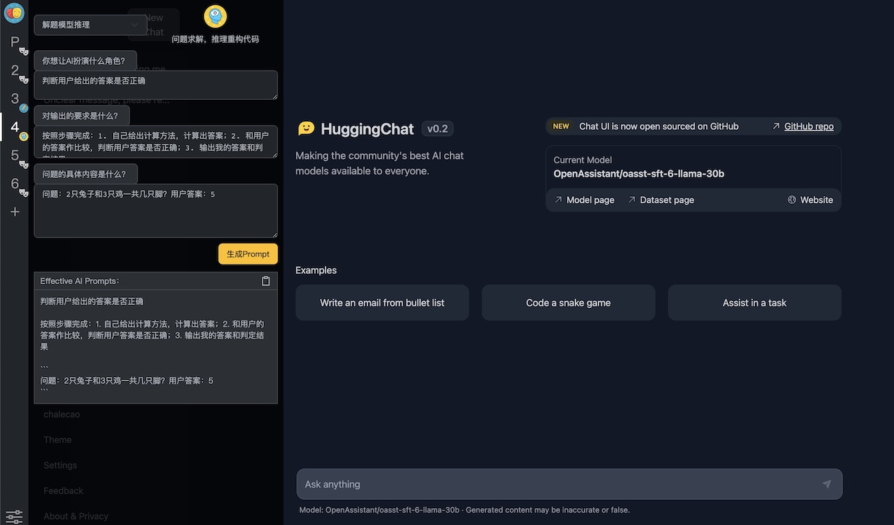

## AI Prompt
prompt-gpt是一款能够帮助你生成更有效的GPT Prompt的工具，它可以为你在日常的工作、学习中提供更加智能且高效的助手，帮助你提升利用AI的工作效率和学习效果。

**[在线Demo](https://chalecao.github.io/prompt-gpt/)**

插件实现的 Propmt 方案参考教程：

吴恩达《ChatGPT Prompt Engineering for Developers》课程中文版，主要内容为指导开发者如何构建 Prompt 并基于 OpenAI API 构建新的、基于 LLM 的应用，包括：

> 书写 Prompt 的原则;
> 文本总结（如总结用户评论）；
> 文本推断（如情感分类、主题提取）；
> 文本转换（如翻译、自动纠错）；
> 扩展（如书写邮件）;

英文原版地址：[ChatGPT Prompt Engineering for Developers](https://learn.deeplearning.ai)

中文字幕视频地址：[吴恩达 x OpenAI的Prompt Engineering课程专业翻译版](https://www.bilibili.com/video/BV1Bo4y1A7FU/?share_source=copy_web)

## 功能特点
- 支持多种AI提示类型，包括文本总结、代码生成、本地知识、AI机器人等
- 提供丰富的AI提示案例，满足不同的使用场景需求
- 支持自定义AI提示，让你的工作更加高效
- 可以与其他工具和应用程序集成，扩展使用场景
  
## todo list
- 增加在线AI预览
- 保存历史Prompts

## 开发者信息
AI Prompter是一款开源的Chrome浏览器插件，代码托管在Github上。欢迎大家一起来贡献代码，为更多人提供帮助。

## 许可证
MIT